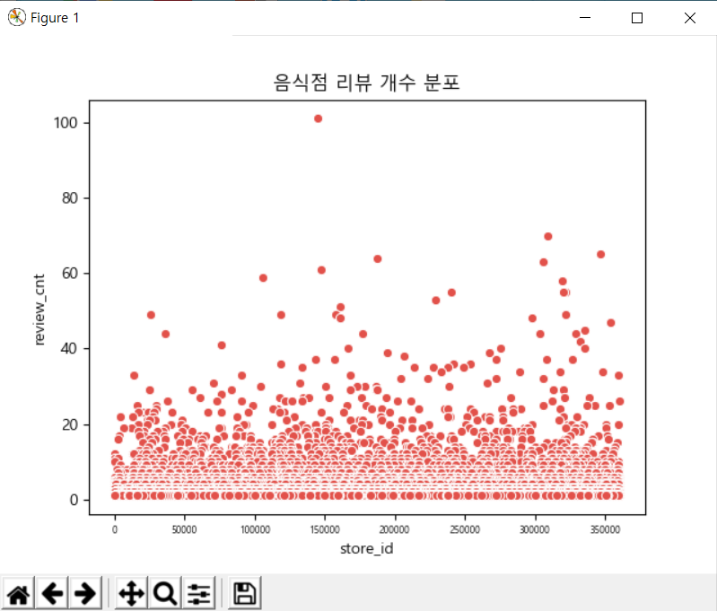
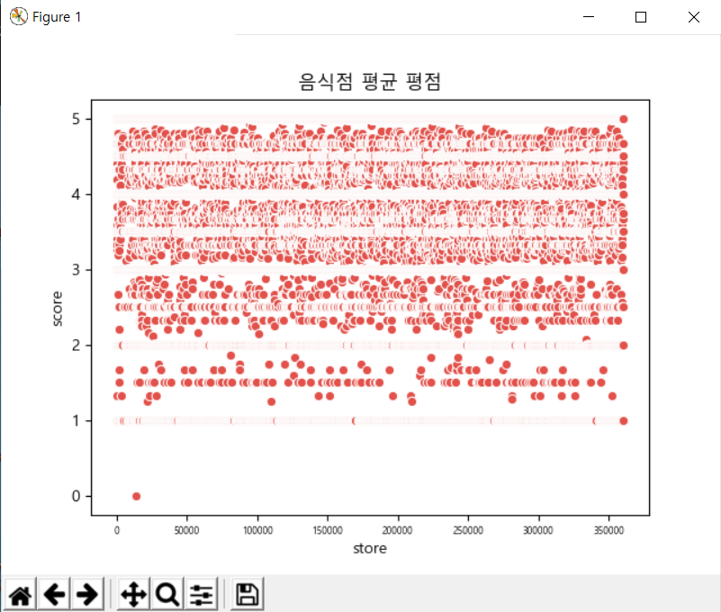
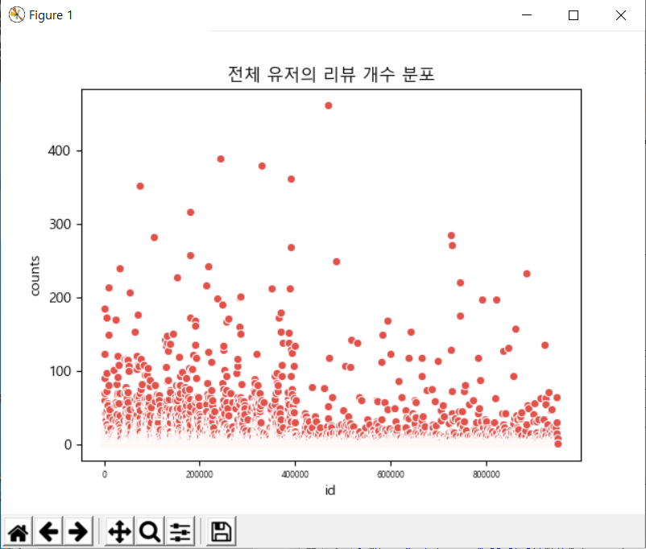
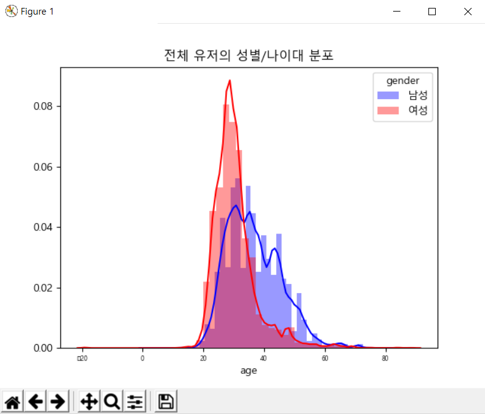

### 결과캡쳐

##### 음식점 리뷰 수 분포

##### 평균 평점 분포

##### 유저 리뷰 수 분포

##### 유저 나이대, 성별 분포

##### 음식점 위치 분포

음식점 위치 분포는 리뷰 개수가 10개 이상이고 평점이 3.0 이상인 음식점만 표시했습니다.
역삼 멀티캠퍼스를 우선적으로 보여지게 했습니다.

parse.py에서 데이터를 파싱할 때 born_year이 0인 사람이 있어 그 사람은 제외시키고 데이터를 파싱하였습니다.